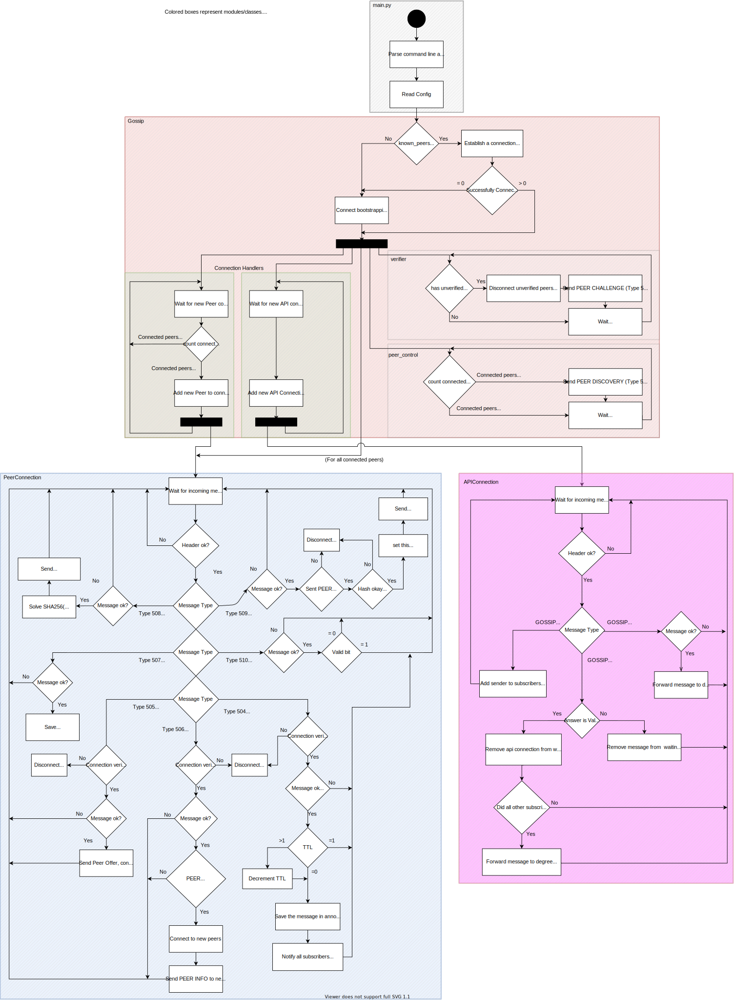
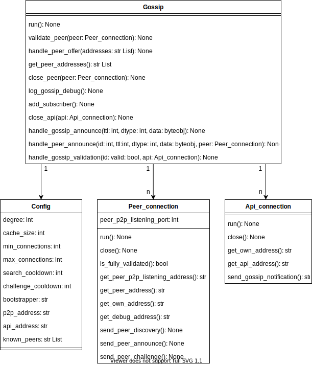

# Gossip
Gossip implementation developed by [Kevin Ploch](https://github.com/plochk "Kevin Ploch GitHub Profile") and [Alexander Liebald](https://github.com/aliebald "Alexander Liebald GitHub Profile") as part of the Peer-to-Peer-Systems and Security course at TUM.

Note: All information within this README is also documented in the [project documentation](docs/documentation.pdf). This README provides a quick overview over the most important options for running this module. The documentation also contains the api this module provides.

## Setup & Dependencies

To execute the program, Python 3.9 or above is required.

Installing dependencies (_hexdump_) can be donne as follows: `python3 -m pip install -r requirements.txt`. Note that depending on your system you may need to use `python` instead of `python3` to call the python interpreter. Simply use the default way of executing python on your os.

## Command Line Arguments
The following information can also be seen if the `-h` or `--help` flag is given. All command line arguments are optional.

- `-v` or `--verbose`: If this flag is set, additional debug information will be displayed during execution. This Information can give a better and more detailed insight into the execution, but is not required for a overview over events during execution.

- `-p` or `--path`: Path to the desired config file. This file must be in the Windows INI file format and comply with the requirements given in the documentation. If this is not given the default config `config.ini` in the root directory is used.

- `-l` or `--logfile`: With this option followed by a valid path, all logging will be written into the file at the end of the path. If the given file does not yet exist, it will be created. Otherwise, new logs will be appended to the current content. Note that the folder structure given in the path must already exist. If this option is not given, logging will happen in the console.

## Config

The following settings can be adjusted in the used config (default = `config.ini` in the root directory) file.

- `cache_size`: Maximum number of data items to be held as part of the peer's knowledge base. Older items will be removed to ensure space for newer items if the peer's knowledge base exceeds this limit. Is used for unverified_peers capacity and peer_announce_ids cache size.
	- Constraints: must be greater than 0.

- `degree`: Number of peers this peer exchanges information with. Relevant for PEER ANNOUNCE.
	- Constraints: must be smaller or equal to min\_connections, min\_connections and greater than 0.

- `min_connections`: Minimum amount of alive connections this peer should try to keep.
	- Constraints: must be greater than 0 and bellow or equal to min\_connections.

- `max_connections`: Maximum amount of alive connections this peer keeps.
	- Constraints: Must be greater than or equal to 2 and min\_connections

- `search_cooldown`: In this interval it is checked whether we have min connections peers. If not start peer discovery.
	- Constraints: must be greater than 0.
	- If this variable is not given the default value of 1 minute is used.

- `challenge_cooldown`: Every challenge\_cooldown seconds the verification process is initiated for all unverified peers. Since this is a security feature, it is not recommended to be experimented with. 
	- Constraints: must be greater than 0.
	- If this variable is not given the default value of 5 minutes is used.

- `p2p_address`: Listening ip and port number for other Gossip peers. Must be a valid and unused port.
	- Constraints: must be a valid IPv4 address in the format \<ip>:\<port>

- `api_address`: Listening ip and port number for API users. Must be a valid and unused port.
	- Constraints: must be a valid IPv4 address in the format \<ip>:\<port>

- `known_peers`: comma separated list containing ip addresses of potential Peers
	- Constraints: must have the format: \<ip>:\<port>,\<ip>:\<port>,... 
	- Can also be left out / not required

- `bootstrapper`: One trustworthy bootstrapping node, used as a fallback in case no known\_peers are given or none can be reached.
	- Constraints: must be a valid IPv4 address in the format \<ip>:\<port>

## Flow Chart

## Class Diagram

# License

This project is licensed under the GNU General Public License (GPL) version 3. While the whole application is available under that license, parts of the implementation are based on an API specification provided by the TUM Chair of Network Architectures and Services as part of the Peer-to-Peer-Systems and Security course. This API specification itself, whose documents are not included in this project but referenced in the project documentation, is proprietary and thus not licensed under the GPL.

If you plan to modify or port this program and publish the results while sticking to the original specification, we urge you to email the chair and clarify any questions that might arise regarding licensing.

	Gossip implementation developed by Kevin Ploch and Alexander Liebald 
	as part of the Peer-to-Peer-Systems and Security course at TUM.
    Copyright (C) 2021 Alexander Liebald, Kevin Ploch

    This program is free software: you can redistribute it and/or modify
    it under the terms of the GNU General Public License as published by
    the Free Software Foundation, either version 3 of the License, or
    (at your option) any later version.

    This program is distributed in the hope that it will be useful,
    but WITHOUT ANY WARRANTY; without even the implied warranty of
    MERCHANTABILITY or FITNESS FOR A PARTICULAR PURPOSE.  See the
    GNU General Public License for more details.

    You should have received a copy of the GNU General Public License
    along with this program.  If not, see <https://www.gnu.org/licenses/>.
